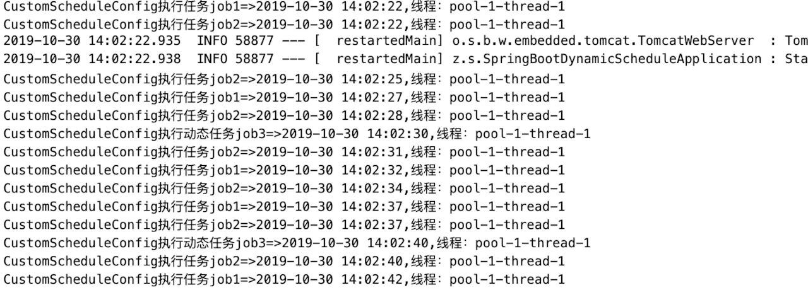
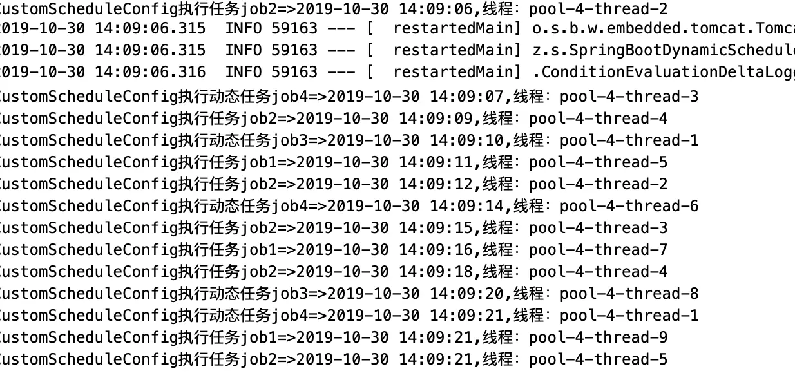

# 06-集成定时任务


## 简介

定时任务是后端开发中常见的需求，主要应用场景有定期数据报表、定时消息通知、异步的后台业务逻辑处理、日志分析处理、垃圾数据清理、定时更新缓存等等。

Spring Boot 集成了一整套的定时任务工具，让我们专注于完成逻辑，剩下的基础调度工作将自动完成。

## 通用实现方式

| 实现方式                        | 描述                                                         |
| ------------------------------- | ------------------------------------------------------------ |
| java.util.Timer                 | Timer 提供了一个 java.util.TimerTask 任务支持任务调度。该方式只能按指定频率执行，不能在指定时间运行。由于功能过于单一，使用较少。 |
| Quartz                          | Quartz 是一个功能比较强大的调度器，支持在指定时间运行，也可以按照指定频率执行。缺点是使用起来相对麻烦。 |
| Spring 框架自带的 Schedule 模块 | 可以看做是轻量级的 Quartz                                    |

## 静态定时任务

```java
@Component
@EnableScheduling
public class StaticScheduleJob {
	
	/**
	 * 上次开始执行时间点后5秒再次执行
	 */
	@Scheduled(fixedRate = 5000)
	public void job3() {
		System.out.println("执行任务job3："+DateUtil.formatDateTime(new Date()));
	}
	
	/**
	 * 上次执行完毕时间点后3秒再次执行
	 */
	@Scheduled(fixedDelay = 3000)
	public void job2() {
		System.out.println("执行任务job2："+DateUtil.formatDateTime(new Date()));
	}
	
	/**
	 * 每隔10秒执行一次（按照 corn 表达式规则执行）
	 */
	@Scheduled(cron = "0/10 * * * * ?")
	public void job1() {
		System.out.println("执行任务job1："+DateUtil.formatDateTime(new Date()));
	}

	
}
```

@EnableScheduling 注解启用定时调动功能

@Scheduled 参数说明：

- @Scheduled(fixedRate = 5000)：上次开始执行时间点后5秒再次执行
- @Scheduled(fixedDelay = 3000)：上次执行完毕时间点后3秒再次执行
- @Scheduled(cron = "0/10 * * * * ?")：每隔10秒执行一次（按照 corn 表达式规则执行）

## Cron 表达式

### 1.Cron表达式格式

> {秒} {分} {时} {日} {月} {周} {年(可选)}

### 2.Cron 表达式字段取值范围及说明

| 字段                | 取值范围                                                     | 允许的特殊字符  |
| ------------------- | ------------------------------------------------------------ | --------------- |
| Seconds（秒）       | 0 ~ 59                                                       | , - * /         |
| Minutes（分）       | 0 ~ 59                                                       | , - * /         |
| Hours（时）         | 0 ~ 23                                                       | , - * /         |
| Day-of-Month（天）  | 可以用数字 1 ~ 31 中的任意一个值，但要注意特殊月份           | , - * ? / L W C |
| Month（月）         | 可以用 0 ~ 11 或者字符串  “JAN、FEB、MAR、APR、MAY、JUN、JUL、AUG、SEP、OCT、NOV、DEC” 表示 | , - * /         |
| Day-of-Week（每周） | 可以用数字 1 ~ 7 表示（1=星期日）或者用字符串 “SUN、MON、TUE、WED、THU、FRI、SAT” 表示 | , - * ? / L C # |
| Year（年）          | 取值范围(1970-2099)，允许为空值                              | , - * /         |

### 3.Cron 表达式中特殊字符的意义

| 特殊字符 | 说明                                                         |
| -------- | ------------------------------------------------------------ |
| *        | 表示可以匹配该域的所有值                                     |
| ？       | 主要用于日和星期，可以匹配域的任意值，但实际不会。当2个子表达式其中之一被指定了值以后，为了避免冲突，需要将另一个子表达式的值设为？ |
| /        | 表示为每隔一段时间。如 0 0/10 * * * ? 其中的 0/10表示从0分钟开始，每隔10分钟执行一次 |
| -        | 表示范围。如 0 0-5 14 * * ? 表示在每天14:00到14:05期间每1分钟执行一次 |
| ,        | 表示枚举多个值，这些值之间是"或"的关系。如 0 10,30 14 * 3 ? 表示每个星期二14点10分或者14点30分执行一次 |
| L        | 表示每月或者每周的最后一天。如 0 0 0 L * ? * 表示每月的最后一天执行 |
| W        | 表示最近工作日。如 0 0 0 15W * ？* 表示每月15号最近的那个工作日执行 |
| #        | 用来指定具体的周数，"#"前面代表星期，"#"后面代表本月的第几周。如"2#1"表示本月第二周的星期日 |

### 4.Cron 在线生成工具

[www.bejson.com/othertools/…](http://www.bejson.com/othertools/cron/)

## 动态定时任务

### 1.实现 SchedulingConfigurer 接口

```java
@Configuration
public class CustomScheduleConfig implements SchedulingConfigurer {

	@Autowired
	private CronTriggerDao cronTriggerDao;

	@Override
	public void configureTasks(ScheduledTaskRegistrar taskRegistrar) {
		// 上次开始执行时间点后5秒再执行
		taskRegistrar.addFixedRateTask(() -> System.out.println("CustomScheduleConfig执行任务job1=>"
				+ DateUtil.formatDateTime(new Date()) + ",线程：" + Thread.currentThread().getName()), 5000);
		// 上次执行完毕时间点后3秒再执行
		taskRegistrar.addFixedDelayTask(() -> System.out.println("CustomScheduleConfig执行任务job2=>"
				+ DateUtil.formatDateTime(new Date()) + ",线程：" + Thread.currentThread().getName()), 3000);
		// 添加一个配合数据库动态执行的定时任务
		TriggerTask triggerTask = new TriggerTask(
				// 任务内容.拉姆达表达式
				() -> {
					// 1）添加任务 Runnable
					System.out.println("CustomScheduleConfig执行动态任务job3=>" + DateUtil.formatDateTime(new Date()) + ",线程："
							+ Thread.currentThread().getName());
					// 2）设置执行周期
				}, triggerContext -> {
					// 3）从数据库获取执行周期
					String cron = cronTriggerDao.getCronTriggerById(1L);
					if (cron != null) {
						// 4）返回执行周期（Date）
						return new CronTrigger(cron).nextExecutionTime(triggerContext);
					} else {
						return null;
					}

				});
		taskRegistrar.addTriggerTask(triggerTask);

	}

}
```

### 2.数据库中初始化数据

这边为了测试简单初始化两行数据：

```sql
SET NAMES utf8mb4;
SET FOREIGN_KEY_CHECKS = 0;

-- ----------------------------
-- Table structure for t_cron_trigger
-- ----------------------------
DROP TABLE IF EXISTS `t_cron_trigger`;
CREATE TABLE `t_cron_trigger` (
  `id` int(8) NOT NULL AUTO_INCREMENT COMMENT '任务id',
  `cron` varchar(20) COLLATE utf8_bin DEFAULT NULL COMMENT 'cron表达式',
  `create_time` datetime DEFAULT NULL COMMENT '创建时间',
  `update_time` datetime DEFAULT NULL COMMENT '更新时间',
  `is_deleted` int(1) DEFAULT '0' COMMENT '作废状态 0-否 1-是',
  PRIMARY KEY (`id`)
) ENGINE=InnoDB AUTO_INCREMENT=3 DEFAULT CHARSET=utf8 COLLATE=utf8_bin;

-- ----------------------------
-- Records of t_cron_trigger
-- ----------------------------
BEGIN;
INSERT INTO `t_cron_trigger` VALUES (1, '0/10 * * * * ?', '2019-10-30 13:40:14', NULL, 0);
INSERT INTO `t_cron_trigger` VALUES (2, '0/7 * * * * ?', '2019-10-30 13:40:34', NULL, 0);
COMMIT;

SET FOREIGN_KEY_CHECKS = 1;

```

### 3.从数据库中读取 cron 表达式值

CronTrigger 实体类

```java
public class CronTrigger implements Serializable{

	/**
	 * 
	 */
	private static final long serialVersionUID = 880141459783509786L;
	
	private Long id;//任务id
	private String cron;//cron表达式
	private String createTime;//创建时间
	private String updateTime;//更新时间
	private boolean isDeleted=false;//删除状态
	
	public Long getId() {
		return id;
	}
	public void setId(Long id) {
		this.id = id;
	}
	public String getCron() {
		return cron;
	}
	public void setCron(String cron) {
		this.cron = cron;
	}
	public String getCreateTime() {
		return createTime;
	}
	public void setCreateTime(String createTime) {
		this.createTime = createTime;
	}
	public String getUpdateTime() {
		return updateTime;
	}
	public void setUpdateTime(String updateTime) {
		this.updateTime = updateTime;
	}
	public boolean isDeleted() {
		return isDeleted;
	}
	public void setDeleted(boolean isDeleted) {
		this.isDeleted = isDeleted;
	}
}
```

CronTriggerDao

```java
public interface CronTriggerDao {
	/**
	 * 根据id获取cron表达式
	 * @param id
	 * @return
	 */
	String getCronTriggerById(Long id);

}
```

CronTriggerMapper.xml

```xml
<?xml version="1.0" encoding="UTF-8"?>
<!DOCTYPE mapper PUBLIC "-//mybatis.org//DTD Mapper 3.4//EN" 
"http://mybatis.org/dtd/mybatis-3-mapper.dtd">
<mapper namespace="cn.zwqh.springboot.dao.CronTriggerDao">
	<resultMap type="cn.zwqh.springboot.model.CronTrigger" id="cronTrigger">
		<id property="id" column="id"/>
		<result property="cron" column="cron"/>
		<result property="createTime" column="create_time"/>
		<result property="updateTime" column="update_time"/>
		<result property="isDeleted" column="is_deleted"/>
	</resultMap>
	<!-- 根据id获取cron表达式 -->
	<select id="getCronTriggerById" resultType="String">
		select cron from t_cron_trigger where is_deleted=0 and id=#{id}
	</select>
</mapper>
```

### 4.测试

启动前记得在启动类上加上 @EnableScheduling

打印日志如下：




## 多线程定时任务

通过上面的日志我们可以看到任务执行都是单线程的。如果要实现多线程执行任务，我们可以通过在 SchedulingConfigurer 接口的 configureTasks方法中添加线程池即可。

### 1.CustomScheduleConfig

```java
@Configuration
public class CustomScheduleConfig implements SchedulingConfigurer {

	@Autowired
	private CronTriggerDao cronTriggerDao;

	@Override
	public void configureTasks(ScheduledTaskRegistrar taskRegistrar) {
		
		//设定一个长度为10的定时任务线程池
		taskRegistrar.setScheduler(Executors.newScheduledThreadPool(10));
		
		// 上次开始执行时间点后5秒再执行
		taskRegistrar.addFixedRateTask(() -> System.out.println("CustomScheduleConfig执行任务job1=>"
				+ DateUtil.formatDateTime(new Date()) + ",线程：" + Thread.currentThread().getName()), 5000);
		// 上次执行完毕时间点后3秒再执行
		taskRegistrar.addFixedDelayTask(() -> System.out.println("CustomScheduleConfig执行任务job2=>"
				+ DateUtil.formatDateTime(new Date()) + ",线程：" + Thread.currentThread().getName()), 3000);
		// 添加第一个配合数据库动态执行的定时任务
		TriggerTask triggerTask = new TriggerTask(
				// 任务内容.拉姆达表达式
				() -> {
					// 1）添加任务 Runnable
					System.out.println("CustomScheduleConfig执行动态任务job3=>" + DateUtil.formatDateTime(new Date()) + ",线程："
							+ Thread.currentThread().getName());
					// 2）设置执行周期
				}, triggerContext -> {
					// 3）从数据库获取执行周期
					String cron = cronTriggerDao.getCronTriggerById(1L);
					if (cron != null) {
						// 4）返回执行周期（Date）
						return new CronTrigger(cron).nextExecutionTime(triggerContext);
					} else {
						return null;
					}

				});
		taskRegistrar.addTriggerTask(triggerTask);
		// 添加第二个配合数据库动态执行的定时任务
		TriggerTask triggerTask2 = new TriggerTask(
				// 任务内容.拉姆达表达式
				() -> {
					// 1）添加任务 Runnable
					System.out.println("CustomScheduleConfig执行动态任务job4=>" + DateUtil.formatDateTime(new Date()) + ",线程："
							+ Thread.currentThread().getName());
					// 2）设置执行周期
				}, triggerContext -> {
					// 3）从数据库获取执行周期
					String cron = cronTriggerDao.getCronTriggerById(2L);
					if (cron != null) {
						// 4）返回执行周期（Date）
						return new CronTrigger(cron).nextExecutionTime(triggerContext);
					} else {
						return null;
					}

				});
		taskRegistrar.addTriggerTask(triggerTask2);

	}

}
```

### 2.测试

打印日志如下： 




## 示例代码

[github](https://github.com/zwqh1992/Spring-Boot-2.X/tree/master/spring-boot-dynamic-schedule)

[码云](https://gitee.com/zwqh/Spring-Boot-2.X/tree/master/spring-boot-dynamic-schedule)

非特殊说明，本文版权归 [朝雾轻寒](https://www.zwqh.top) 所有，转载请注明出处.


作者：朝雾轻寒链接：https://juejin.im/post/5db92bef6fb9a0204d6598a4来源：掘金著作权归作者所有。商业转载请联系作者获得授权，非商业转载请注明出处。