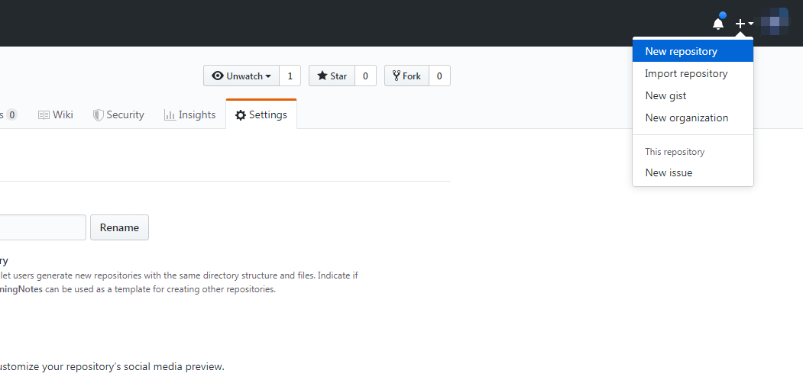
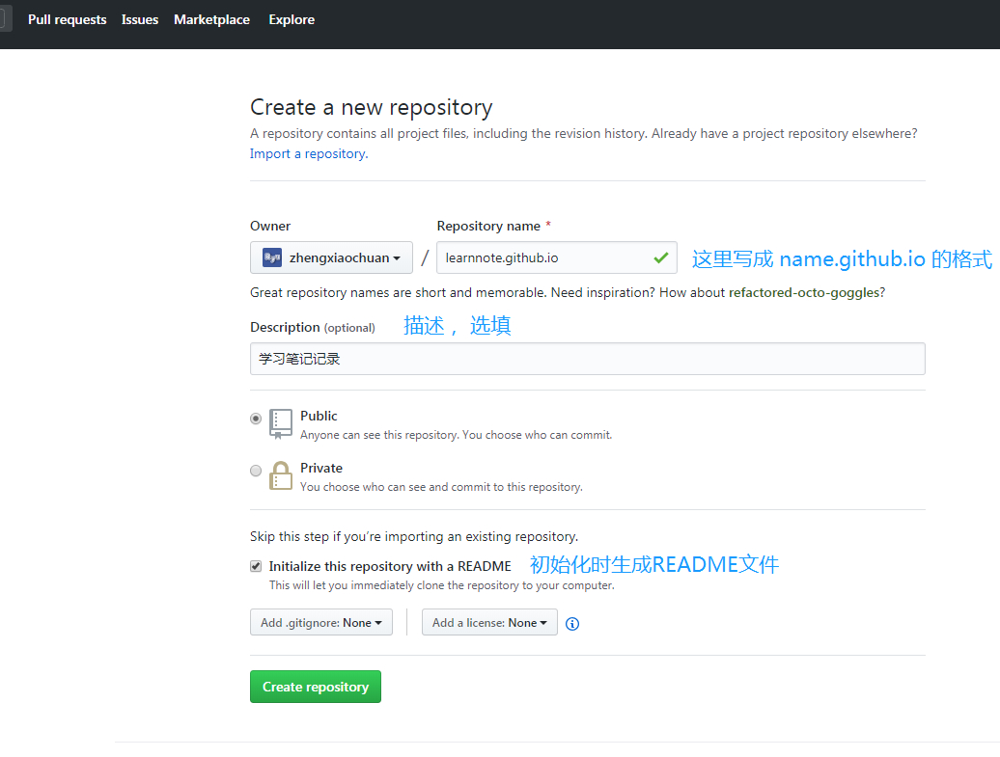

# VuePress与Github Pages搭配完成线上站点


## 整体思路

1. Github 创建项目，本地创建切换到 docs 分支，通过 VuePress 构建文档项目（写一些文档），上传至 Github。

2. Travis CI 自动 clone 后安装依赖、编译、上传至 Github master 分支。

3. 通过 GitHub Pages 功能将 master 分支上的内容展示在 Web 上。


**相关资料：**

- 我的文档看下效果：[codexu.github.io/](https://codexu.github.io/)
- 我的文档源码：[github.com/codexu/code…](https://github.com/codexu/codexu.github.io)
- VuePress中文文档(1.x)：[v1.vuepress.vuejs.org/zh/](https://v1.vuepress.vuejs.org/zh/)
- Travis CI：[travis-ci.org](https://travis-ci.org)


## VuePress构建文档项目

使用 VuePress 初始化项目，只说几点，[官方文档](https://v1.vuepress.vuejs.org/zh/guide/getting-started.html#全局安装)写的十分详细。

- 依赖安装在 devDependencies。
- package.json script 写运行和打包脚本，"serve": "vuepress dev docs"，"build": "vuepress build docs"。（这里按照自己习惯，后面做持续集成要用）
- 创建 docs 文件夹，把所有 markdown 文档存放在这里。
- docs/.vuepress/config.js 可以做大量配置。


## GitHub上进行站点的搭建

### GitHub上创建仓库
登录[GitHub]( https://github.com/ )后，在页面右上角的加号中找到“New repository”按钮，创建一个新的仓库，而且仓库的名字为： `[name].github.io`，例如我的文档是`learnnote.github.io`。

   （注意：我们写入的名字要以**github.io**做后缀，不然创建出来的不是GitHub Pages） 
> 为什么用 [name].github.io ？
>  因为在这个项目下，可以直接使用 https://[name].github.io/ 域名，简洁易记。

   

进入到创建仓库页面，按照步骤创建，最后点击按钮完成仓库的创建。



### 将GitHub上仓库克隆到本地

选择本地存放Github项目的文件目录， 然后再该目录下使用以下命令行将仓库clone到本地：

> git clone https://github.com/zhengxiaochuan/learnnote.github.io.git


3. 通过 `git checkout -b docs` 切换到 docs 分支，docs 分支存放文档源码，master 分支存放打包好的 HTML 等文件。

> 为什么使用 master 分支存放打包后的文件？
>  因为在 [name].github.io 项目下没得选，你也可以换个其他仓库，就可以避免这个问题。

4. 写一些文档，做一下简单的配置，先别急着提交到 Github。


### 通过 Travis CI 做自动化打包及部署

1. 在根目录下创建 `.travis.yml` 文件，并写入一些内容：

```yaml
language: node_js
node_js:
    - 10
cache: yarn
install:
    - yarn
script:
    - yarn build
after_success:
    - cd docs/.vuepress/dist
    - git init
    - git config --global user.name "${U_NAME}"
    - git config --global user.email "${U_EMAIL}"
    - git add -A
    - git commit -m 'deploy'
    - git push --quiet --force "https://${GH_TOKEN}@${GH_REF}" master:${P_BRANCH}
```

- language: 语言选择 node_js，我们前端还有的选吗？
- node_js: node版本，这块也许是越高越快？
- cache: yarn 缓存，能使你构建速度更快...吧。
- install: 安装依赖的包管理工具，使用 yarn 比 npm 快的多。
- script: 一切就绪之后通过 yarn install 安装依赖。
- after_success: 安装结束后，我们做一些打包和 push 到 Github 的指令。
- 环境变量 `"${***}"` 这块后面会提到。

2. 这时候可以 push 到 Github 了，因为没有 `.travis.yml` Travis CI 是不会理你的项目的，同时将默认分支改为 docs。


3. Github 增加一个 Personal access tokens，位置在 [Settings / Developer settings](https://github.com/settings/tokens)。


- Note 随意填，填 travis-ci 就行。
- 除了 delete_repo 权限都打勾就行。

4. 进入 [Travis CI](https://travis-ci.org)，使用 Github 登陆， 进入 [dashboard](https://travis-ci.org/dashboard)，此时应该可以看到你刚创建的项目。


5.启动进入这个项目，右上角 More options 点击 setting，配置环境变量。


- GH_REF: 项目地址（github.com/[name]/[name].github.io.git）注意去掉 `https://`。
- GH_TOKEN: tocken 是通过上面第三部拿到的。
- P_BRANCH: 要上传的分支，这里我们要传到 master。
- U_EMAIL: 你的 Github 邮箱。
- U_NAME: 你的 Github 用户名。


### 开启 GitHub Pages


### 访问线上站点